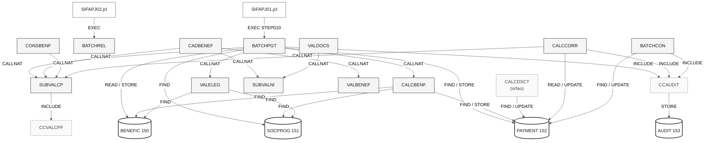

# Mapa de Dependências — SIFAP Legado

> **Trilha:** [Kit do Time](../README.md) › [Estágio 1](README.md) › **Mapa de Dependências**

**Artefato preenchido pelo time durante o Estágio 1 — Passo 3.** Registra as dependências entre programas Natural e DDMs Adabas que sustentam o escopo selecionado.

| Campo | Valor |
|---|---|
| **Público-alvo** | Todas as duplas, com liderança da Dupla 2 (Arquitetura) |
| **Pré-requisitos** | Catálogo de regras com as origens identificadas |
| **Estágio** | Estágio 1 — Arqueologia |
| **Resultado esperado** | Diagrama Mermaid e tabelas de arestas com evidência `arquivo:linha` |

> [!IMPORTANT]
> Mapeie apenas as dependências que explicam o escopo selecionado: programas `.NSN` que chamam outros programas (`CALLNAT`, `FETCH`) e programas que acessam DDMs (`READ`, `FIND`, `STORE`, `UPDATE`, `DELETE`). Toda aresta precisa estar apoiada em `arquivo:linha` — nenhuma inferência sem evidência. Este mapa alimenta as hipóteses de fatiamento em [`discovery-report.md`](discovery-report.md).

> [!NOTE]
> Guia passo a passo: [`GUIDE.md`](GUIDE.md).

**Time**: <!-- preencher -->
**Escopo**: cobertura completa — 24 membros Natural e 4 DDMs

---

## Diagrama Mermaid

---

## Arestas Programa → Programa

| # | De | Para | Tipo | Evidência (`arquivo:linha`) |
|---|---|---|---|---|
| 1 | `BATCHPGT` | `SUBVALCP` | `CALLNAT` | `BATCHPGT.NSP:276` |
| 2 | `BATCHPGT` | `VALELEG` | `CALLNAT` | `BATCHPGT.NSP:369` |
| 3 | `BATCHPGT` | `CALCBENF` | `CALLNAT` | `BATCHPGT.NSP:381` |
| 4 | `BATCHPGT` | `CCAUDIT` | `INCLUDE` | `BATCHPGT.NSP:588` |
| 5 | `CADBENEF` | `SUBVALCP` | `CALLNAT` | `CADBENEF.NSP:161` |
| 6 | `CADBENEF` | `SUBVALNI` | `CALLNAT` | `CADBENEF.NSP:196` |
| 7 | `CADBENEF` | `VALBENEF` | `CALLNAT` | `CADBENEF.NSP:263` |
| 8 | `CONSBENF` | `SUBVALCP` | `CALLNAT` | `CONSBENF.NSP:136` |
| 9 | `VALDOCS` | `SUBVALNI` | `CALLNAT` | `VALDOCS.NSP:109` |
| 10 | `CALCCORR` | `SUBVALCP` | `CALLNAT` | `CALCCORR.NSP:160` |
| 11 | `CALCCORR` | `CCAUDIT` | `INCLUDE` | `CALCCORR.NSP:245` |
| 12 | `SUBVALCP` | `CCVALCPF` | `INCLUDE` | `SUBVALCP.NSN:96` |
| 13 | `BATCHCON` | `CCAUDIT` | `INCLUDE` | `BATCHCON.NSP` (área de sub-rotinas) |
| 14 | `SIFAPJ01` | `BATCHPGT` | `EXEC PGM=NATBATCH` | `SIFAPJ01.jcl:47-78` |

---

## Arestas Programa → DDM

| # | Programa | DDM | Operação | Evidência (`arquivo:linha`) |
|---|---|---|---|---|
| 1 | `BATCHPGT` | `BENEFIC` | `READ` | `BATCHPGT.NSP:247` |
| 2 | `BATCHPGT` | `PAYMENT` | `FIND NUMBER` | `BATCHPGT.NSP:299` |
| 3 | `BATCHPGT` | `SOCPROG` | `FIND` | `BATCHPGT.NSP:306` |
| 4 | `BATCHPGT` | `PAYMENT` | `STORE` | `BATCHPGT.NSP:488` |
| 5 | `CALCBENF` | `BENEFIC` | `FIND` | `CALCBENF.NSN:179` |
| 6 | `CALCBENF` | `SOCPROG` | `FIND` | `CALCBENF.NSN:190` |
| 7 | `CALCBENF` | `PAYMENT` | `STORE` | `CALCBENF.NSN:319` |
| 8 | `VALELEG` | `BENEFIC` | `FIND` | `VALELEG.NSN:89` |
| 9 | `VALELEG` | `SOCPROG` | `FIND` | `VALELEG.NSN:104` |
| 10 | `CALCDSCT` | `PAYMENT` | `FIND` / `UPDATE` | `CALCDSCT.NSP:78`, `:180` |
| 11 | `CALCCORR` | `PAYMENT` | `READ` / `UPDATE` | `CALCCORR.NSP:175`, `:210` |
| 12 | `BATCHCON` | `PAYMENT` | `FIND` / `UPDATE` | `BATCHCON.NSP:174`, `:207` |
| 13 | `CCAUDIT` | `AUDIT` | `READ` / `STORE` | `CCAUDIT.NSC:72`, `:108` |

---

## Observações

- **Programas mais conectados (hubs):** `SUBVALCP` (4 chamadores), `CCAUDIT` (3 inclusões), `PAYMENT` (5 programas escrevem nele) e `BENEFIC` (4 programas leem).
- **Programas isolados ou código morto:** `CALCDSCT.NSP` é **órfão** — nenhum `CALLNAT` aponta para ele em todo o acervo, apesar de o cabeçalho de `BATCHPGT.NSP:16` declarar "CALLS CALCBENF AND CALCDSCT". É um programa interativo com `INPUT` (`CALCDSCT.NSP:70`), incompatível com execução batch. `BATCHCON` não tem JCL (`BATCHCON.NSP:14-15`).
- **Ordem de dependência do batch:** `SIFAPJ01` → `BATCHPGT` → (`SUBVALCP`, `VALELEG`, `CALCBENF`) → `SIFAPJ02` → `BATCHREL`. A conciliação (`BATCHCON`) roda fora de qualquer cadeia automatizada.
- **Dupla escrita em `PAYMENT`:** tanto `CALCBENF.NSN:319` quanto `BATCHPGT.NSP:488` executam `STORE PAYMENT-V` no mesmo ciclo, para o mesmo beneficiario e período. Registrado como `SIFAP-M-05`.

---

## Definição de pronto

- [x] Toda aresta relevante ao escopo cita `arquivo:linha`.
- [x] Diagrama Mermaid gerado com o cabeçalho `%%{init:...}%%` e a paleta neutra.

---

### Continue lendo

| Anterior | Próximo |
|---|---|
| [Catálogo de Regras](business-rules-catalog.md) Passo 2 — extração de regras. | [Questões em Aberto](mysteries-found.md) Passo 4 — registro de incertezas. |

[Voltar ao índice do kit](../README.md)
