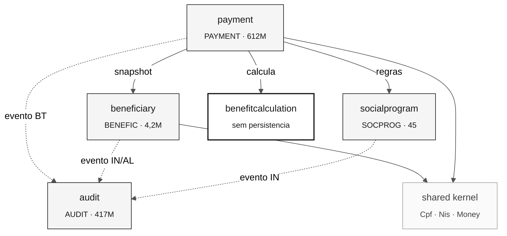

# Mapa de bounded contexts — SIFAP 2.0

> **Trilha:** [Kit do Time](../README.md) › [Estágio 2](README.md) › **Bounded contexts**

**Decomposição derivada da leitura completa do acervo legado no Estágio 1.** Cada fronteira é justificada por propriedade de dados observada no código, não por convenção de nomenclatura.

| Campo | Valor |
|---|---|
| **Público-alvo** | Dupla 2 (Arquiteto de Software + Arquiteto Corporativo) |
| **Pré-requisitos** | [`dependency-map.md`](../01-archaeology/dependency-map.md), [`business-rules-catalog.md`](../01-archaeology/business-rules-catalog.md) |
| **Estágio** | Estágio 2 — Especificação |
| **Feature relacionada** | [`specs/001-monthly-payroll-generation/`](../specs/001-monthly-payroll-generation/spec.md) |

---

## Critério de decomposição aplicado

A fronteira foi traçada onde **a propriedade de escrita de um arquivo Adabas é inequívoca**. O mapa de dependências mostra 4 arquivos e 13 arestas programa→DDM. Um contexto só existe se responder sim a: *este módulo é o único que pode alterar este dado?*

Onde a resposta foi não, a fronteira foi movida — não negociada.

---

## Avaliações de hipóteses

### Hipótese 1: um contexto por prefixo de programa (`CAD`, `CALC`, `VAL`, `REL`, `BATCH`) — REJEITADA

| Critério | Avaliação | Evidência |
|---|---|---|
| Coesão | Baixa | `CALC` mistura `CALCBENF` (subprograma de domínio) e `CALCCORR` (programa interativo que altera `PAYMENT`) — funções e ciclos de vida distintos |
| Acoplamento | Alto | `VAL` ficaria dono de `VALELEG`, que lê `BENEFIC` **e** `SOCPROG`, atravessando duas fronteiras de dados |
| Frequência de mudança | Incoerente | `BATCHREL` (relatório, muda por formatação) e `BATCHPGT` (folha, muda por regra legal) mudariam juntos |

**Por que rejeitamos:** o prefixo codifica o *tipo de membro Natural*, não o domínio. Confirmado em [`inventory.md`](../01-archaeology/inventory.md): `CC`↔`.NSC`, `PDA`↔`.NSA`, `LDA`↔`.NSL`. Usar o prefixo como fronteira replicaria uma convenção de compilador de 1997 na arquitetura de 2026.

### Hipótese 2: "Validação de Documentos" como contexto próprio — REJEITADA

| Critério | Avaliação | Evidência |
|---|---|---|
| Coesão | Alta | `SUBVALCP` e `SUBVALNI` compartilham `PDAVALID.NSA` e a norma NT-SUPDE-011/1998 |
| Acoplamento | — | Não possui dado algum: `SUBVALCP.NSN:8` declara "does not input or write" |
| Frequência de mudança | Muito baixa | Módulo 11 de CPF não muda desde 1998 |

**Por que rejeitamos:** um contexto delimitado precisa ser dono de um modelo. Validação de CPF/NIS é uma **função pura sem estado**, invocada por 4 contextos diferentes (`dependency-map.md`, arestas 1, 5, 8, 10). Isso é a definição de **Shared Kernel**, não de contexto. Promovê-lo a contexto criaria uma chamada remota para calcular um dígito verificador.

### Hipótese 3: "Conciliação Bancária" separada de "Pagamento" — REJEITADA

| Critério | Avaliação | Evidência |
|---|---|---|
| Coesão | Alta | `BATCHCON` encapsula todo o protocolo CNAB 240 |
| Acoplamento | Proibitivo | `BATCHCON.NSP:200-222` executa `UPDATE PAYMENT-V` alterando `STAT-PAYMENT` — escreve no agregado de outro contexto |
| Frequência de mudança | Divergente | Layout bancário muda por decisão da Febraban; regra de pagamento muda por lei |

**Por que rejeitamos:** duas fronteiras não podem escrever no mesmo agregado. Manter a conciliação fora de Pagamento exigiria expor `STAT-PAYMENT` para escrita externa, o que destrói o invariante da máquina de estados. A tensão de cadência de mudança é real e será resolvida **dentro** do contexto, por uma camada anticorrupção que isola o layout CNAB do modelo de domínio.

### Hipótese 4: "Relatórios" como contexto próprio — REJEITADA

| Critério | Avaliação | Evidência |
|---|---|---|
| Coesão | Média | `RELPGT`, `RELAUDIT` e `BATCHREL` só formatam e agregam |
| Acoplamento | Alto | Todos leem dados de que não são donos |
| Frequência de mudança | Alta e independente | Mudam por formatação de impressora, não por regra |

**Por que rejeitamos:** relatórios são **modelos de leitura** sobre agregados alheios. `RELPGT.NSP:186-200` inclusive *reinterpreta* o significado de `STAT-PAYMENT` (ver `SIFAP-M-19`) — sintoma clássico de leitura sem propriedade. Serão projeções dentro do contexto dono do dado.

---

## Bounded contexts finais

### 1. Cadastro de Beneficiários (`beneficiary`)

| Campo | Valor |
|---|---|
| **Responsabilidade** | Manter a identidade, o endereço, os dependentes e o status do beneficiário |
| **Dados sob sua responsabilidade** | `BENEFIC` (FNR 150) — 4,2 milhões de registros, incluindo o grupo periódico `GRP-DEPEND` |
| **Interface pública** | `BeneficiaryQuery.findByCpf(Cpf)`, `BeneficiarySnapshot` (somente leitura), evento `BeneficiaryStatusChanged` |
| **Por que é um contexto próprio** | Único escritor de `BENEFIC`: `CADBENEF.NSP:280` e `CADDEPEN.NSP`. Nenhum outro programa do acervo executa `STORE`/`UPDATE` nesse arquivo |

### 2. Catálogo de Programas Sociais (`socialprogram`)

| Campo | Valor |
|---|---|
| **Responsabilidade** | Manter os ~45 programas, seus valores base, regras de elegibilidade e parâmetros de cálculo |
| **Dados sob sua responsabilidade** | `SOCPROG` (FNR 151) — tabela de parâmetros, incluindo `FACTOR-K` e as faixas `GRP-CALC-BAND` |
| **Interface pública** | `SocialProgramQuery.findByCode(ProgramCode)`, `ProgramRules` (objeto de valor imutável) |
| **Por que é um contexto próprio** | Único escritor: `CADPROG.NSP:141`. Ciclo de vida radicalmente distinto — 45 registros que mudam por portaria, contra 4,2 milhões que mudam por atendimento |

### 3. Cálculo de Benefício (`benefitcalculation`)

| Campo | Valor |
|---|---|
| **Responsabilidade** | Decidir elegibilidade e calcular valor bruto, descontos e valor líquido |
| **Dados sob sua responsabilidade** | **Nenhuma tabela.** É domínio puro: recebe `BeneficiarySnapshot` + `ProgramRules`, devolve `BenefitCalculation` |
| **Interface pública** | `EligibilityService.assess(...)`, `BenefitCalculator.calculate(...)` |
| **Por que é um contexto próprio** | Concentra 22 das 53 regras catalogadas e **todas** as regras que mudam por decisão da Coordenação de Benefícios. É o ativo que a modernização precisa preservar com precisão de centavo |

> [!IMPORTANT]
> Este contexto não escreve em lugar nenhum — decisão deliberada. No legado, `CALCBENF.NSN:319` grava `PAYMENT` diretamente, e é exatamente essa mistura que produz a dupla gravação de `SIFAP-M-05`. Ver [ADR-002](adr/ADR-002-fonte-unica-de-calculo.md).

### 4. Pagamento (`payment`)

| Campo | Valor |
|---|---|
| **Responsabilidade** | Gerar a folha do período, controlar a máquina de estados do pagamento, conciliar o retorno bancário e aplicar correção monetária |
| **Dados sob sua responsabilidade** | `PAYMENT` (FNR 152) — 612 milhões de registros, incluindo o grupo periódico `GRP-DISC` |
| **Interface pública** | `PayrollGenerationService.generate(ReferencePeriod)`, `PaymentQuery.findByPeriod(...)`, evento `PaymentGenerated` |
| **Por que é um contexto próprio** | Único dono de `PAYMENT`. Absorve a conciliação (hipótese 3) e a correção monetária, porque ambas mutam o mesmo agregado |

### 5. Trilha de Auditoria (`audit`)

| Campo | Valor |
|---|---|
| **Responsabilidade** | Registrar, de forma imutável, toda alteração de dado do sistema |
| **Dados sob sua responsabilidade** | `AUDIT` (FNR 153) — 417 milhões de registros, somente inserção |
| **Interface pública** | `AuditRecorder.record(AuditEvent)` (escrita), `AuditQuery` (leitura) |
| **Por que é um contexto próprio** | Exigência legal independente do domínio (IN-TCU 63/2010, retenção mínima de 10 anos por Lei 8.159 art. 14). `AUDIT.ddm:16-17` proíbe reorganização. Os outros quatro contextos dependem dele, e ele não depende de nenhum |

### Shared Kernel: `documentvalidation` + `sharedtypes`

| Campo | Valor |
|---|---|
| **Responsabilidade** | Validação de CPF e NIS por módulo 11; tipos monetários e de período |
| **Dados sob sua responsabilidade** | Nenhum — funções puras e objetos de valor |
| **Interface pública** | `Cpf.of(String)`, `Nis.of(String)`, `Money`, `ReferencePeriod` |
| **Por que não é um contexto** | Sem estado e sem dono. Consolidar aqui resolve as **três** implementações divergentes de módulo 11 registradas no bônus de `mysteries-found.md` |

---

## Comunicação entre contextos

| De | Para | Mecanismo | Dados |
|---|---|---|---|
| `payment` | `beneficiary` | Chamada síncrona de interface | `BeneficiarySnapshot` por CPF |
| `payment` | `socialprogram` | Chamada síncrona de interface | `ProgramRules` por código |
| `payment` | `benefitcalculation` | Chamada síncrona de função pura | Snapshot + regras → `BenefitCalculation` |
| `payment` | `audit` | Evento de domínio | `AuditEvent` com ação `BT` |
| `beneficiary` | `audit` | Evento de domínio | `AuditEvent` com ação `IN`/`AL` |
| `socialprogram` | `audit` | Evento de domínio | `AuditEvent` com ação `IN` |
| Todos | `documentvalidation` | Chamada direta (shared kernel) | CPF/NIS |

> [!NOTE]
> `benefitcalculation` **não** chama `beneficiary` nem `socialprogram`. Recebe tudo por parâmetro. Isso substitui o padrão legado em que `CALCBENF.NSN:179-196` relê os mesmos registros que `BATCHPGT.NSP:247` acabou de ler — um N+1 sobre 4,2 milhões de linhas.



---

## Mapeamento para módulos Maven

```text
backend/
├── shared-kernel/          Cpf, Nis, Money, ReferencePeriod
├── beneficiary/            domain · application · infrastructure
├── socialprogram/          domain · application · infrastructure
├── benefitcalculation/     domain (apenas — sem infrastructure)
├── payment/                domain · application · infrastructure
└── audit/                  domain · application · infrastructure
```

Uma única unidade implantável. As dependências entre módulos são verificadas por ArchUnit; `benefitcalculation` não pode declarar dependência de nenhum módulo `infrastructure`.

---

## Definição de pronto

- [x] Hipóteses avaliadas, com as 4 rejeições documentadas e justificadas.
- [x] Cinco contextos nomeados, cada um com propriedade de dados inequívoca.
- [x] Diagrama Mermaid com paleta neutra.

---

### Continue lendo

| Anterior | Próximo |
|---|---|
| [Mapa de Dependências](../01-archaeology/dependency-map.md)<br/><sub>Evidência das fronteiras.</sub> | [Especificação 001](../specs/001-monthly-payroll-generation/spec.md)<br/><sub>Requisitos EARS do recorte.</sub> |

<sub>[Voltar ao índice do kit](../README.md)</sub>
